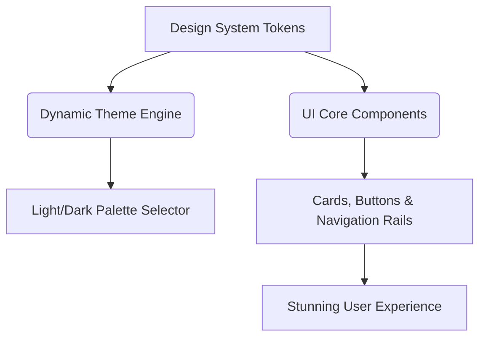

# <div align="center"><br>Solomon Rajan Portfolio</div>

<div align="center">

[](https://gemini.google.com)
[](https://support.google.com/colab/answer/13699051)
[](https://code.visualstudio.com/)
[](https://github.com/solomonrajan/solomonrajan.github.io/deployments)
[](https://github.com/solomonrajan/solomonrajan.github.io/commits)
[](#)
[](#-licensing)
[](#-licensing)
[](#-support-the-project)

</div>

---

<p align="center">
  <b>A modern, responsive, and high-performance personal portfolio website.</b><br>
  Built following the latest <b>Google Material Design 3 (M3)</b> specifications, featuring dynamic color palettes, sleek layouts, and smooth animations.<br>
  <br>
  <i>This entire repository is purely for hobby purposes. The codebase is built using HTML, CSS, and JavaScript.</i>
</p>

<div align="center">
  <kbd>✨ Google Material Design 3</kbd> &nbsp;•&nbsp; <kbd>📱 Responsive Grid</kbd> &nbsp;•&nbsp; <kbd>🌗 Light/Dark Mode</kbd> &nbsp;•&nbsp; <kbd>⚡ Clean & Accessible</kbd>
</div>

<br>

<div align="center">
  
  
  
</div>

---

## 📖 Table of Contents

<div align="center">

| Section                                                              | Description                                                       |
| :------------------------------------------------------------------- | :---------------------------------------------------------------- |
| [✨ Key Features](#-key-features)                                    | Highlights of the portfolio's functionality and design.           |
| [🎨 Material 3 Architecture](#-material-3-architecture)              | Design tokens and thematic configuration.                         |
| [📄 Repository Structure](#-repository-structure--page-architecture) | Architecture and multi-page routing breakdown.                    |
| [💻 Languages & Code](#-languages--code-types-used)                  | The core web technologies driving the frontend.                   |
| [🛠️ Tech Stack](#-tech-stack)                                        | Overview of tools, fonts, and privacy-friendly analytics.         |
| [🚀 Quick Start & Deployment](#-quick-start--deployment)             | Instructions for running locally and deploying via GitHub Pages.  |
| [📜 Licensing](#-licensing)                                          | Dual-license terms for the software code and creative content.    |
| [🤝 Credits](#-credits--acknowledgments)                             | Acknowledgments for tools, AI assistants, and resources used.     |
| [💖 Support the Project](#-support-the-project)                      | Ways to contribute and support the continuous development.        |
| [🔒 Security Audit Logs](#-weekly-security-audit-logs)               | Automated weekly reports verifying site security headers.         |

</div>

---

## ✨ Key Features

- **Dynamic Theme Engine:** Automated dark/light theme switching aligning with Material Design 3 color systems and typography (`Inter` & `Google Sans Flex`).
- **Multi-Entry Point & Performance Architecture:** Standalone HTML entry points (`home`, `about`, `projects`, `contact`, `blog`, and 7 dedicated article routes) sharing a compiled React application bundle for instant load times, clean URL normalization (`replaceState`), and OWASP anti-clickjack protection.
- **Integrated Blog & RSS Syndication:** Comprehensive blog system with standalone routes (`blog/post-1` through `blog/post-7`) and an XML syndication feed (`blog/rss.xml`) covering employee welfare, HR technology, and leadership.
- **Privacy-First Analytics & Automated Security Audits:** Built-in Umami cloud analytics alongside automated GitHub Actions security checks verifying strict security headers (`Content-Security-Policy`, HSTS, OWASP Framekiller, `X-Content-Type-Options`).
- **Grid Layouts & Accessibility:** Clean card-based structures with fluid hover states, elevation tokens, fully semantic markup, and optimized color contrast ratios.

---

## 🎨 Material 3 Architecture

This project is built directly around the design tokens of **Material 3**:



### Color Palette Reference

| System Role   | Light Theme | Dark Theme | Usage                                         |
| :------------ | :---------- | :--------- | :-------------------------------------------- |
| **Primary**   | `#915500`   | `#FFB951`  | Primary actions, branding, key accents        |
| **Secondary** | `#6D5D3E`   | `#DAC49F`  | Auxiliary highlights, tags, and status states |
| **Surface**   | `#FDF7EC`   | `#17130A`  | Backdrops, container fills, and cards         |

---

## 📄 Repository Structure & Page Architecture

This portfolio operates on a multi-entry-point architecture. Each page is a standalone HTML entry point that shares the same compiled React application bundle, ensuring instant load times and visual consistency.

The currently rendered page is determined by a global flag initialized in the `<script>` tag inside each file's `<head>`:

```html
<script>
  window.CURRENT_PAGE = "page_identifier";
</script>
```

### Page Reference Directory

| HTML / Asset Entry Point                       | Page Identifier (`window.CURRENT_PAGE`) | Description & Content Focus                                                                                   |
| :--------------------------------------------- | :-------------------------------------- | :------------------------------------------------------------------------------------------------------------ |
| [`index.html`](./index.html)                   | `"home"`                                | **Home / Welcome Dashboard:** Executive summary, welfare officer highlights, and quick navigation.            |
| [`about/index.html`](./about/index.html)       | `"about"`                               | **About Me:** Biography, education, philosophy, core values, work experience, and skills.                     |
| [`projects/index.html`](./projects/index.html) | `"projects"`                            | **Projects Portfolio:** Key initiatives, welfare program implementations, and workforce development studies.  |
| [`contact/index.html`](./contact/index.html)   | `"contact"`                             | **Contact Portal:** Inquiry forms, professional networking links, and communication channels.                 |
| [`blog/index.html`](./blog/index.html)         | `"blog"`                                | **Blog Index:** Overview of articles, thoughts, and insights on employee welfare and industry trends.         |
| [`blog/post-1/index.html`](./blog/post-1/index.html) | `"blog/post-1"`                         | **Blog Post 1:** *Creating a Positive Workplace Culture* – Strategies for supportive work environments.       |
| [`blog/post-2/index.html`](./blog/post-2/index.html) | `"blog/post-2"`                         | **Blog Post 2:** *Employee Welfare Programs That Matter* – Implementing impactful welfare initiatives.        |
| [`blog/post-3/index.html`](./blog/post-3/index.html) | `"blog/post-3"`                         | **Blog Post 3:** *The Importance of Workplace Compliance* – Staying compliant with labor laws and ethics.     |
| [`blog/post-4/index.html`](./blog/post-4/index.html) | `"blog/post-4"`                         | **Blog Post 4:** *Effective Communication in Remote Teams* – Best practices for distributed work cohesion.    |
| [`blog/post-5/index.html`](./blog/post-5/index.html) | `"blog/post-5"`                         | **Blog Post 5:** *The Future of Work: Hybrid Models* – Preparing organizations for hybrid work transformations.|
| [`blog/post-6/index.html`](./blog/post-6/index.html) | `"blog/post-6"`                         | **Blog Post 6:** *AI in Human Resources* – Streamlining recruitment, onboarding, and employee engagement.     |
| [`blog/post-7/index.html`](./blog/post-7/index.html) | `"blog/post-7"`                         | **Blog Post 7:** *Mastering Employee Retention* – Proven strategies to motivate top performers.               |
| [`blog/rss.xml`](./blog/rss.xml)               | *N/A (RSS Syndication Feed)*            | **RSS Feed:** XML syndication feed for automatic updates and feed readers.                                    |

### How to Modify Content or Add a Page

1. **Content Adjustments:** Content can be modified within each HTML file or via custom components in the bundle.
2. **Page Configuration:** When adding a new entry point, duplicate an existing HTML page, change the output file name, and update the value of `window.CURRENT_PAGE` to your new view identifier.

---

## 💻 Languages & Code Types Used

This repository is built using the core languages of the web:

- **HTML (HyperText Markup Language):** Provides the foundational structure and semantics for all pages and components.
- **CSS (Cascading Style Sheets):** Powers the styling, responsive grids, Material Design 3 tokens, and fluid animations.
- **JavaScript:** Handles client-side interactivity, dynamic theming, and component state logic.

> [!NOTE]
> While GitHub's language statistics might show this repository strictly as 100% HTML (via `.gitattributes`), it fully leverages modern CSS and JavaScript embedded within the HTML architecture to deliver its high-performance, dynamic experience.

---

## 🛠️ Tech Stack

- **Structure:** [HTML5](https://developer.mozilla.org/en-US/docs/Web/HTML) & [Semantic Elements](https://developer.mozilla.org/en-US/docs/Glossary/Semantics)
- **Styling:** [CSS3 (Custom Variables)](https://developer.mozilla.org/en-US/docs/Web/CSS) and Google Fonts (`Inter`, `Google Sans Flex`, `Google Symbols`)
- **Interactions:** [React](https://react.dev/) and [JavaScript (ES6+)](https://developer.mozilla.org/en-US/docs/Web/JavaScript)
- **Hosting:** [GitHub Pages](https://pages.github.com/)

---

## 🚀 Quick Start & Deployment

### 1. Clone the Repository

```bash
git clone https://github.com/solomonrajan/solomonrajan.github.io.git
cd solomonrajan.github.io
```

### 2. Run Locally

Because this project is built on pure static web technologies, you can preview it instantly:

- Open `index.html` directly in your browser.
- Alternatively, launch a local web server (e.g., using Python's http server or VS Code's Live Server):

```bash
python -m http.server 8000
```

### 3. Edit and Modify Pages

Because this website is optimized for lightning-fast loading, it does not use traditional HTML tags in the `<body>`. Instead, the entire site is a **Compiled React Application** bundled inside the `<script type="module">` tag within `index.html`.

To edit the website's content, you will need to find and modify the JavaScript object properties rather than HTML tags.

#### Step 1: Open the Target File

Open the specific HTML file for the page you want to edit in a code editor like **VS Code**.

- For the Home Page: Open `index.html` at the root.
- For the About Page: Open `about/index.html`.
- For Blog Pages/Posts: Open `blog/index.html` or the respective post file (e.g., `blog/post-1/index.html`).

#### Step 2: Use "Find" to Locate Content

Since the code is minified (squished together), manually scrolling is very difficult.

- Press **Ctrl+F** (Windows) or **Cmd+F** (Mac) to open the search bar.
- Type in the exact text, title, or image file name you want to change (e.g., search for `"Solomon Rajan"`).

#### Step 3: Understanding the Code Structure (HTML vs Bundled Code)

When you locate the content, it will look like minified JavaScript. Here is a cheat sheet on how standard HTML translates into this code:

**1. Text Content (`children`)**

- **HTML:** `<h1>Hello World</h1>`
- **Bundled Code:** `children: "Hello World"`
- **How to Edit:** Safely change the text inside the quotation marks.
  - _Example:_ Change `children: "Welcome"` to `children: "Hello there!"`

**2. HTML Elements (`jsx` / `jsxs` functions)**

- **HTML:** `<div>...</div>`
- **Bundled Code:** `jsx("div", { ... })` or `jsxs("div", { ... })`
- **How to Edit:** You generally do not need to change the element type (`"div"`, `"p"`, `"section"`). Focus on editing the properties inside the `{ }`.

**3. CSS Classes (`className`)**

- **HTML:** `<div class="card shadow">`
- **Bundled Code:** `className: "card shadow"`
- **How to Edit:** Add or remove Tailwind/CSS classes within the quotes to change layouts or colors.

**4. Images & Links (`src` & `href`)**

- **HTML:** `` and `<a href="https://example.com">`
- **Bundled Code:** `src: "profile.jpg"` and `href: "https://example.com"`
- **How to Edit:** Replace the URL or file path inside the quotes with your new image path or link.

> [!WARNING]  
> **Syntax is Critical!** Be extremely careful not to accidentally delete commas `,`, colons `:`, curly braces `{ }`, or quotation marks `""`. A single missing comma will break the entire page!

#### Step 4: Save and Preview

Once you have modified your text or links, save the file and refresh your web browser to instantly view your changes!

**How to add a new page or blog post:**

1. Create a new folder in the appropriate directory (e.g., `my-new-page` at the root, or `blog/post-8` inside the `blog` directory).
2. Copy an existing `index.html` file (for example, from `about/` or `blog/post-1/`) and paste it into your new folder.
3. Open the newly copied `index.html` file.
4. Locate the configuration script at the top, inside the `<head>` tag:
   ```html
   <script>
     window.CURRENT_PAGE = "my-new-page"; // or "blog/post-8"
   </script>
   ```
5. Update `window.CURRENT_PAGE` to a unique identifier for your new page or post.
6. Using the search method described above, find and replace the text content in the JavaScript bundle (`assets/main.js`) or within local custom components to fit your new view.
7. If adding a blog post, add a new entry for your post inside `blog/rss.xml` and update navigation or blog index links accordingly.

### 4. Deploy to GitHub Pages

Simply commit your changes and push to the `main` branch. GitHub Pages will detect the changes and deploy them automatically!

```bash
git add .
git commit -m "Update portfolio content"
git push origin main
```

---

## 📜 Licensing

This personal website is open-source but utilizes a dual-licensing framework to distinguish code from media and creative content:

- **Software / Code:** Under the [MIT License](LICENSE). You are free to copy, modify, and distribute the structural and logic code.
- **Design, Prose, & Media:** [All Rights Reserved](COPYRIGHT.md). No one is allowed to use, share, adapt, or redistribute any media, content, UI design, or assets from this repository.

---

## 🤝 Credits & Acknowledgments

- **Google Gemini:** This repository was simply made with the help of [Google Gemini](https://gemini.google.com).
- **Google Antigravity:** Developed and edited with the help of [Google Antigravity](https://github.com).
- **Microsoft VSCode:** Edited and structured using MSCode.
- **Material Design:** Icons and typography sourced from Google's [Material Symbols](https://fonts.google.com/icons) library.
- **Animated Fluent Emojis:** Emojis used in this repository are sourced from [Tarikul-Islam-Anik/Animated-Fluent-Emojis](https://github.com/Tarikul-Islam-Anik/Animated-Fluent-Emojis).
- **React:** Component architecture powered by [React](https://react.dev/).
- **Vite:** Next Generation Frontend Tooling used for building and bundling by [Vite](https://vitejs.dev/).
- **Umami:** Privacy-focused website analytics powered by [Umami](https://umami.is/).

---

## 💖 Support the Project

This repository is built purely as a hobby. If you find this project helpful or inspiring, you can support its continued development!

[](https://liberapay.com/solomon.rajan)

---

## 🔒 Weekly Security Audit Logs

### Security Audit Report - Sun, 19 Jul, 2026, 08:59:13 am IST

> [!NOTE]
> 🎯 **Target:** `https://solomonrajan.github.io`  
> 🛡️ **Score:** `6 / 6` security headers present.

- **✅** `strict-transport-security` is present: `max-age=31556952`
- **✅** `content-security-policy` is present via HTML <meta> tag.
- **✅** `x-frame-options` is mitigated via OWASP Framekiller script.
- **✅** `x-content-type-options` is present via HTML <meta> tag.
- **✅** `referrer-policy` is present via HTML <meta> tag.
- **✅** `permissions-policy` is omitted (Unsupported natively on GitHub Pages).

*This is an automated weekly security audit generated by GitHub Actions.*
